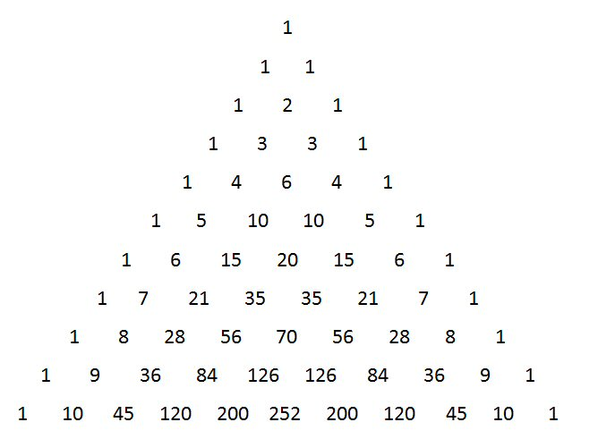

# pascal

## Compute the nth row of the pascal triangle

```cpp
vector<int>pascal(n);
```

will return the nth row of the pascal triangle, stored in a vector of integers. See below example:

```cpp
vector<int> test = pascal(3);
for(auto i : test){
    cout << i;
}
//Code above returns: 121
```

<figure><figcaption><p>Pascal triangle</p></figcaption></figure>
